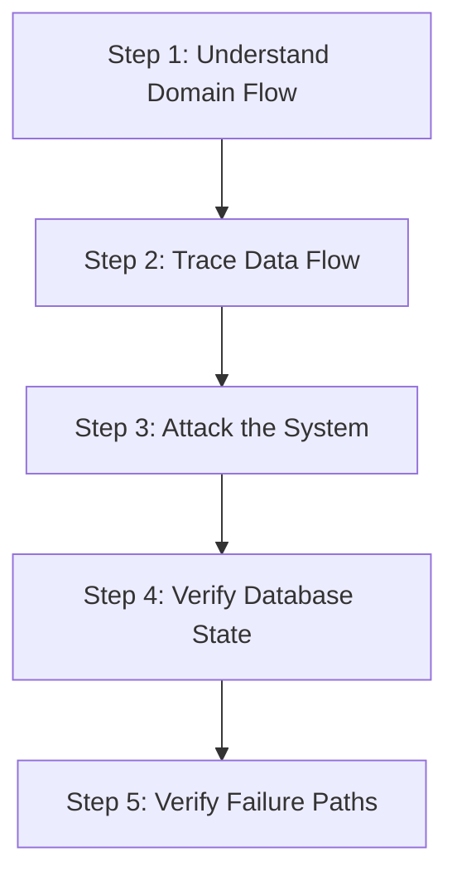

# ICMS Backend Security & Logical Analysis Guide
**Version:** 1.0  
**Target:** ICMS (.NET 9 Clean Architecture Backend)  
**Audience:** AI Coding Agents, Developers, Auditors, Graduation Project Reviewers  

---

## Purpose

This document defines the comprehensive methodology required for analyzing, debugging, stress-testing, and auditing the Integrated Clinic Management System (ICMS) backend. 

The focus of this guide is **NOT** on syntax or compilation errors. Instead, it targets **real-world system failures, security vulnerabilities, business rule bypasses, concurrency flaws, and data corruption issues**. 

Healthcare systems are mission-critical. Inconsistencies in medical history, unauthorized access to maternal records, or inventory drift in vaccine batches carry high real-world risks. Any developer or AI agent working on this codebase must adopt the mindset of a system architect, a security penetration tester, a malicious client, and a healthcare workflow auditor.

---

## System Context

The ICMS backend is structured around **Clean Architecture** patterns:
* **`ICMS.Domain`**: Encapsulates core business models (Entities, Value Objects, Domain Enums, Exceptions).
* **`ICMS.Application`**: Defines interfaces, services, validators, and DTOs.
* **`ICMS.Infrastructure`**: Implements persistence via Entity Framework Core (PostgreSQL), Hangfire background processing, and SignalR hubs.
* **`ICMS.API`**: Exposes controllers, manages global exception handling middleware, CORS, rate limiting, and JWT authentication.

---

## Core Analysis Philosophy

1. **Zero Trust in Controllers & Clients**: Never assume the controller is receiving validated or well-intentioned data. Never trust that the frontend restricts unauthorized actions.
2. **State & Order Verification**: Do not assume API endpoints are called in the logical chronological order. A malicious or custom client can hit `/api/visit-details` before creating a pregnancy record, or attempt to log a postpartum complication without a corresponding delivery.
3. **Impersonation & Access Verification**: Assume every request will attempt to spoof user identities, manipulate IDs in parameters, or send requests on behalf of other organizational units (clinics, districts, governorates).

---

## Critical Audit Areas

---

### 1. Authentication & Authorization

#### Objective
Ensure users are strictly authenticated and can only execute actions permitted by their roles and organizational boundaries.

#### Verification Protocol
* **JWT Configuration**: Open [Program.cs](file:///d:/Files/Others/Source%20Code/GitHub%20Clone%20Projects/ICMS-Fullstack/ICMS/ICMS.API/Program.cs) and inspect the `TokenValidationParameters`.
  * Ensure `ValidateIssuer` and `ValidateAudience` are set to `true`.
  * Verify `ValidateLifetime` is active and clock skew is minimal (e.g., zero or default 5 minutes).
  * Confirm that the signing key is loaded securely and meets minimum length criteria (HMAC-SHA256 requires at least 256 bits / 32 bytes).
* **Cookie & Header Security**: Inspect cookie configurations for refresh tokens:
  * Ensure the `HttpOnly` flag is `true` (preventing XSS access).
  * Ensure `Secure` is `true` (restricting transmission to HTTPS).
  * Verify `SameSite` policies (`Strict` or `Lax`) are enforced.
* **Refresh Token Rotation (RTR)**: Verify that when a refresh token is used, it is rotated. If a client attempts to reuse a used refresh token, the entire family of refresh tokens associated with that user session must be immediately invalidated to prevent replay attacks.

#### Logical Tests
1. **Privilege Escalation**: Log in as a user with a low-level role (e.g., `FieldWorker` or `Viewer`). Attempt to send a `POST` or `DELETE` request to administrative endpoints (such as `api/users` or `api/vaccines`). The server must respond with `403 Forbidden` rather than executing the operation.
2. **Horizontal Access Violation**: Obtain an ID of a pregnancy detail record belonging to a patient in another district. Attempt to read or edit this record using a clinic-level account restricted to your own district. Verify that the service layer checks the user's organizational boundary and returns an authorization failure.
3. **Token Replay**: Capture a valid refresh token payload. Attempt to call the `/api/auth/refresh` endpoint twice using the same token. The second request must be rejected, and any active access tokens generated from the first request should be flagged.

#### Red Flags
> [!CAUTION]
> * **CRITICAL**: Missing `[Authorize]` attributes on controller classes or endpoints.
> * **CRITICAL**: Trusting a `UserId` or `ClinicId` provided directly in the request body (e.g., `CreateRecordDto.UserId`). These values must always be resolved server-side from the authenticated claims (`User.FindFirst(ClaimTypes.NameIdentifier)`).
> * **HIGH**: Storing plaintext refresh tokens in the database without hashing.

---

### 2. Input Validation & Business Rule Enforcement

#### Objective
Prevent malformed, malicious, or logically inconsistent data from corrupting the database or disrupting clinical logic.

#### Verification Protocol
* **FluentValidation Auditing**: Inspect validators in the `ICMS.Application` assembly (e.g., [PaginationValidator](file:///d:/Files/Others/Source%20Code/GitHub%20Clone%20Projects/ICMS-Fullstack/ICMS/ICMS.Application/Validators/PaginationValidator.cs)). Verify that validators are registered in the DI container and applied automatically.
* **Domain Invariant Validation**: Ensure validation rules are not just checking syntax (e.g., email formats), but are checking business logic constraints.
* **Nullable Reference Types**: Pay close attention to compiler warnings regarding non-nullable properties exiting constructors without values (`CS8618`). In EF Core, this can lead to database fields containing unexpected `NULL` values or triggering runtime `NullReferenceExceptions`.

#### Logical Tests
1. **Validation Bypass**: Send a raw payload bypassing the client-side forms. Inject negative age values, future dates for past vaccinations, or mismatched strings. The server must abort before reaching the database, returning a `400 Bad Request` containing structured error details.
2. **Maternal History Chronology**: Attempt to create a `PregnancyDetails` record where the `LMPDate` (Last Menstrual Period) is in the future, or the `ExpectedDeliveryDate` occurs before the `LMPDate`. The application must fail validation.
3. **Vaccination Gap Logic**: Attempt to register a second vaccine dose (e.g., Pentavalent 2) for an infant where the date is only 5 days after Pentavalent 1. The domain rules (which require a minimum of 4 weeks / 28 days interval) must throw a validation error.

#### Red Flags
> [!WARNING]
> * **CRITICAL**: Validating business rules (like checking if a patient is female for pregnancy registration) exclusively on the frontend.
> * **HIGH**: Missing date boundary validation (e.g., letting users register births occurring 150 years ago or in the future).
> * **HIGH**: Converting DTOs directly to Entities using raw property assignment without executing the entity's domain factory methods (e.g., `Newborn.Create(...)`).

---

### 3. Inventory Consistency & Stock Corruption

#### Objective
Ensure that vaccine stock transactions are mathematically sound, transaction histories are immutable, and concurrency does not lead to negative balances.

#### Verification Protocol
* **Transaction Isolation**: Inspect inventory update operations (such as `RemoveStockByDoseAsync` in `BatchService`). Confirm they occur within an explicit database transaction block using `IDbContextTransaction`.
* **Mathematical Invariants**: Verify that whenever a stock quantity increases or decreases, a corresponding `Transaction` entity is written to the audit log matching the delta exactly.
* **Concurrency Safeguards**: Verify how EF Core handles concurrent requests targeting the same batch. Ensure RowVersion or explicit locks are applied.

#### Logical Tests
1. **Concurrent Stock Deduction**: Write a script (or use a test helper) to fire 10 concurrent requests to deduct 5 doses from a batch containing exactly 15 doses. If optimistic concurrency is working, 7 requests must fail with a concurrency exception or a validation error, and the final stock balance must be exactly 0, never negative.
2. **Rollback Integrity**: Force a database write failure on the `Transaction` entity after successfully updating the `Batch` quantity. Verify that the entire unit of work rolls back, leaving both the `Batch` and `Transaction` tables unchanged.

#### Red Flags
> [!CAUTION]
> * **CRITICAL**: Deducting or adding stock by fetching a batch, calculating the new total in memory, and saving it back without using concurrency tokens or database-level transactions.
> * **CRITICAL**: Allowing negative inventory quantities (`Batch.TotalQuantity < 0`).
> * **HIGH**: Not recording a historical ledger entry (`Transaction` table) for every modification of stock levels.

---

### 4. Entity Framework Core Risks

#### Objective
Prevent common EF Core pitfalls that lead to severe performance degradation, memory exhaustion, or database locks.

#### Verification Protocol
* **SQL Profiling**: Enable EF Core logging in development mode and inspect output queries.
* **Query Tracking Behavior**: Verify that read-only queries (e.g., listings, dropdowns, statistics) explicitly append `.AsNoTracking()` to reduce memory footprint and context tracking overhead.
* **Eager vs. Lazy Loading**: Audit all navigation properties. Check that related tables are loaded using `.Include()` rather than relying on lazy loading, which can cause severe performance issues.

#### Logical Tests
1. **N+1 Query Detection**: Access an endpoint that lists 50 child records and displays their vaccination history. Check the console logs. If you see 51 distinct SQL `SELECT` queries (1 for the list, 50 for the details), you have found an N+1 query bug. The service must be refactored to use `.Include()` or a projected DTO query.
2. **Memory Growth Audit**: Measure the memory impact of loading large data grids (such as the complete geographic neighborhood tree). Ensure server-side pagination and projection are applied.

#### Red Flags
> [!WARNING]
> * **CRITICAL**: Invoking `_unitOfWork.SaveChangesAsync()` inside a `foreach` loop. This sends multiple database roundtrips and can lead to partial saves. Always invoke it once at the end of the logical transaction.
> * **CRITICAL**: Executing queries that pull entire tables into memory (`.ToList()`) before applying filters (`.Where()`, `.Take()`).
> * **HIGH**: Cascade deletes enabled on major transactional relationships (e.g., deleting a patient automatically deletes all associated system audit records).

---

### 5. API Security Vulnerabilities

#### Objective
Shield the API endpoints against injection, parameter manipulation, and denial-of-service attempts.

#### Verification Protocol
* **Parameter Auditing**: Review controller parameters for direct resource identification.
* **Overposting Prevention**: Verify that controllers accept specialized DTO request models rather than domain entities directly.
* **Rate Limiting Policies**: Review `Program.cs` to ensure that rate-limiting policies (e.g., the global IP partitioner or stricter auth limiters) are active on all public and high-cost routes.

#### Logical Tests
1. **IDOR (Insecure Direct Object Reference)**: Authenticate as `UserA`. Attempt to fetch `/api/people/5` where ID `5` belongs to a patient of `UserB` outside your clinic. The server must block access.
2. **Mass Assignment Check**: Attempt to call `PUT /api/users/{your-id}` sending a payload containing `{ "role": "Admin", "isActive": true }`. Verify that the endpoint ignores these properties if they are not defined in the mapped DTO.

#### Red Flags
> [!CAUTION]
> * **CRITICAL**: Binding database entities directly to action arguments: `public Task<IActionResult> UpdateUser(User user)`.
> * **HIGH**: Exposing internal exceptions or database error details (e.g., Npgsql stack traces) in the API response. These must be caught and logged, returning generic problem details.

---

### 6. Database Integrity

#### Objective
Ensure the database schema enforces business integrity constraints, acting as the final line of defense against application-level failures.

#### Verification Protocol
* **Schema Constraints Configuration**: Review database configuration files under [Persistence/Config/](file:///d:/Files/Others/Source%20Code/GitHub%20Clone%20Projects/ICMS-Fullstack/ICMS/ICMS.Infrastructure/Persistence/Config/).
* **Seed Isolation**: Confirm that geographic and system seeds are isolated and do not conflict with runtime-generated keys.

#### Logical Tests
1. **Unique Index Violations**: Attempt to manually insert a record directly into the database with a duplicate national ID or duplicate vaccine code. The database must throw a unique constraint violation error.
2. **Null Constraint Enforcement**: Ensure that critical foreign keys (such as `DoseId` on `Batch`, or `PersonId` on `User`) are configured as non-nullable in both the database schema and EF Core configurations.

#### Red Flags
> [!WARNING]
> * **CRITICAL**: Soft-deleted entities (using an `IsDeleted` flag) lacking global query filters in `AppDbContext`. This can result in soft-deleted users appearing in active lists or logging into the application.
> * **HIGH**: Tables missing primary keys, appropriate foreign key relations, or unique indexes on business identifiers.

---

### 7. Concurrency & Multi-User Failures

#### Objective
Prevent data loss and database inconsistencies when multiple users modify shared records simultaneously.

#### Verification Protocol
* **Concurrency Tokens**: Check if models subject to modifications (like `Batch`, `SystemSetting`, or `PregnancyDetails`) use concurrency tokens (e.g., `[Timestamp]` columns or row versions).
* **Idempotency Safeguards**: Verify that actions like submitting a health advisory broadcast or adding an immunization record use idempotency checks to prevent duplicate actions if double-clicked.

#### Logical Tests
1. **Double Submission**: Simulate a user double-clicking "Register Dose". Send two identical requests within 50 milliseconds. The application should detect the duplicate action and return a conflict or handle the request idempotently.
2. **Stale Data Write**: Load a vaccine configuration screen in two browser windows. Modify the name to "Name A" in Window 1 and save. Modify the code to "Code B" in Window 2 (which still holds the old state) and save. The second save must fail with a concurrency exception.

---

### 8. Audit Logging & Traceability

#### Objective
Provide a chronological log of all changes made to sensitive clinical, financial, and security states.

#### Verification Protocol
* **Audit Coverage**: Ensure sensitive entities (such as users, roles, stocks, and clinical records) log their operations.
* **Actor Identification**: Verify that audit logs record the exact timestamp, the IP address, and the identity of the user who initiated the request.

#### Logical Tests
1. **Silent Deletion Check**: Attempt to soft-delete a patient profile. Confirm that a record is created in the audit log capturing the operation, date, and user details.
2. **Log Integrity**: Verify that log files (under `Logs/`) or audit tables cannot be altered or deleted by application-level roles.

---

### 9. SignalR & Realtime Security

#### Objective
Ensure that live WebSocket connections cannot be hijacked to leak reports or flood the server with notifications.

#### Verification Protocol
* **Hub Security**: Open [ReportHub.cs](file:///d:/Files/Others/Source%20Code/GitHub%20Clone%20Projects/ICMS-Fullstack/ICMS/ICMS.API/Hubs/ReportHub.cs) (or other Hubs). Verify they are decorated with `[Authorize]`.
* **Group Management**: Verify that clients are only added to hubs or groups for which they have permissions.

#### Logical Tests
1. **SignalR Connection Hijacking**: Attempt to establish a connection to `/hubs/reports` without passing a valid JWT access token query parameter. The connection must be rejected with a `401 Unauthorized`.
2. **Cross-Tenant Subscription**: Attempt to join a group associated with another clinic's reports. Verify that the connection or group-joining logic validates your permission boundary before adding you to the group.

---

### 10. Hangfire & Background Jobs

#### Objective
Ensure that recurring tasks, daily broadcasts, and trackers execute reliably, handle failures gracefully, and are secure against unauthorized access.

#### Verification Protocol
* **Dashboard Protection**: Check `Program.cs` for the Hangfire dashboard endpoint routing. Verify that dashboard authorization filters are configured so the dashboard is not publicly accessible in production.
* **Job Idempotency**: Verify that background workers (e.g., `DailyMissedDoseTracker` or `AdvisoryDispatchBackgroundService`) can be run multiple times without causing duplicate notifications or double-decrementing stock.

#### Logical Tests
1. **Retry Loop Safety**: Simulate a network failure during the execution of a background task. Ensure the job framework retries the job without creating duplicate records.
2. **Dashboard Security Bypass**: Attempt to access `http://localhost:{port}/hangfire` without an authenticated administrator session. The server must deny access.

---

### 11. Files & Report Generation

#### Objective
Protect the server filesystem from traversal attacks and malicious script executions during PDF exports or document uploads.

#### Verification Protocol
* **Filename Sanitization**: Verify that files generated or uploaded are named using system-generated GUIDs or sanitized keys rather than user-provided filenames.
* **Storage Location Isolation**: Verify that uploads are stored outside of the application's execution root and that directories do not grant execute permissions.

#### Logical Tests
1. **Path Traversal Attack**: Send a request to fetch an export using a filename containing path traversal sequences (e.g., `../../appsettings.json`). The server must reject the input or sanitize the directory traversal indicators.
2. **Malicious Upload Bypass**: Attempt to upload a file with an executable extension disguised as an image (e.g., `malware.exe.pdf` or `shell.aspx`). The MIME validator must inspect the file header and block the upload.

---

### 12. Performance & DOS Resilience

#### Objective
Ensure the application remains available and responsive under heavy request loads or complex report query stress.

#### Verification Protocol
* **Pagination Audit**: Verify that all index or listing endpoints require `PageNumber` and `PageSize` limits.
* **Heavy Compute Isolation**: Verify that long-running tasks, such as generating consolidated regional reports, are executed asynchronously or delegated to background workers rather than blocking the main thread.

#### Logical Tests
1. **Unbounded Query Stress**: Call the patient listing endpoint with a page size request of 100,000. The application must enforce a maximum page size ceiling (e.g., 100).
2. **Blocking Operations Verification**: Review code paths for synchronous database calls (e.g., `.ToList()` instead of `.ToListAsync()`). Ensure all I/O-bound operations are fully asynchronous to prevent thread starvation under load.

---

## Analysis Methodology

Developers and AI auditors must follow this structured, multi-layered approach to evaluate any feature or pull request.



### Step 1: Understand Domain Flow
Begin by mapping the business rules and domain invariants of the feature.
* **Identify preconditions**: What states must exist before this action can run? (e.g., To record a vaccination dose, the vaccine batch must be active, have stock, and not be expired).
* **Identify postconditions**: What updates must happen? (e.g., Stock is deducted, an audit ledger entry is created, next dose schedules are calculated).

### Step 2: Trace Data Flow
Trace the code path from the entry point down to the database:
1. **Controller Entry**: Does it validate the request? Is authorization correctly set up?
2. **DTO to Domain Mapping**: Are inputs properly sanitized? Are they mapped securely without exposing private setters?
3. **Validation logic**: Are all business rules verified?
4. **Service Execution**: Is database interaction wrapped in a transaction? Are calculations performed server-side?
5. **Persistence**: Does the database call compile to clean, optimal SQL?

### Step 3: Attack the System
Active stress testing:
* Send out-of-order calls.
* Fire concurrent requests to trigger race conditions.
* Manipulate identifiers and payloads to verify access controls.
* Inject nulls, empty strings, and special characters.

### Step 4: Verify Database State
After tests, inspect the database state:
* Run validation queries to ensure no orphan rows or invalid values exist.
* Verify that stock totals match transaction history ledger totals.
* Confirm that soft-deleted entities do not appear in active datasets.

### Step 5: Verify Failure Paths
Force failure conditions during execution:
* Kill the database connection midway through a transaction.
* Inject bad parameters during database save operations.
* Verify that all changes roll back and that errors are caught, sanitized, and logged.

---

## Expected Report Format

When reporting security vulnerabilities, business rule bypasses, or database corruption issues, format findings as follows:

### 1. [ISSUE TITLE]
*A concise title outlining the core failure.*

* **Severity**: [Critical / High / Medium / Low]
* **Location**: File path + class/method.

#### Root Cause
Explain the logical or architectural flaw.

#### Attack / Failure Scenario
Provide a step-by-step example of how this issue can be exploited or trigger a system failure.

#### Impact
Detail the technical and business consequences (e.g., patient records exposed, vaccine inventory corrupted).

#### Fix Recommendation
* **Architectural Fix**: High-level design adjustment.
* **Code-Level Fix**: Detailed adjustments needed in code.
* **DB-Level Fix**: Constraint or index adjustments.

#### Safe Implementation Example
```csharp
// Provide a code snippet illustrating the safe, corrected pattern.
```

---

## High-Risk Areas in ICMS

Pay close attention to these modules during code reviews:

| Module | Risk Level | Primary Vulnerabilities |
| :--- | :--- | :--- |
| **Inventory** | **Critical** | Concurrency issues, stock drift, negative inventory, missing ledger records. |
| **Vaccination Workflows** | **Critical** | Dose order validation bypasses, date logical errors, missing safety checks. |
| **Authentication & Session** | **Critical** | Refresh token reuse, privilege escalation, unvalidated claims. |
| **Pregnancy Lifecycle** | **Critical** | Delivery date chronology bypasses, invalid newborn tracking, unauthorized access. |
| **Report Exports** | **High** | Path traversal, resource depletion (DOS), file system leaks. |
| **Background Jobs** | **High** | Non-idempotent task execution, exposed dashboard panels. |
