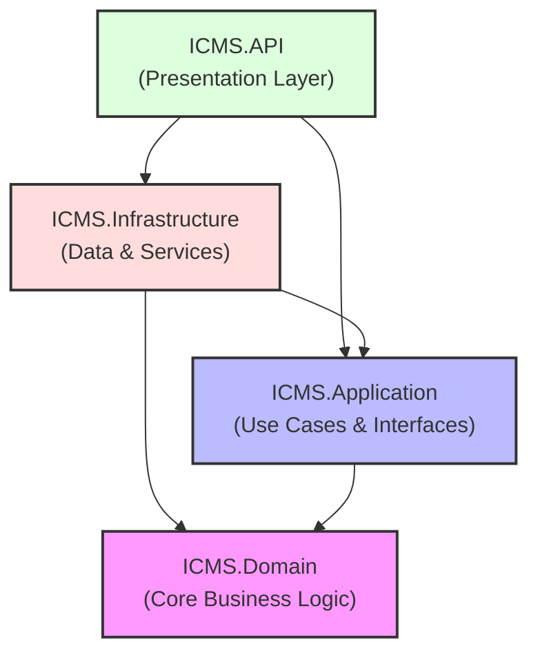

# 🏥 Integrated Clinic Management System (ICMS) - Backend

Welcome to the backend service of the **Integrated Clinic Management System (ICMS)**. This is a mission-critical, high-performance, and secure healthcare management API built on **.NET 9** utilizing **Clean Architecture** patterns. 

The backend acts as the single source of truth for clinical registries, maternal healthcare tracking, vaccine inventory management, geographical reporting, and real-time alerts.

---

## 🏗 System Architecture

The project follows the **Clean Architecture** pattern, enforcing strict separation of concerns, decoupling business logic from external frameworks, and ensuring testability.



### Layer Breakdown & Dependency Flow

1. **[ICMS.Domain](file:///d:/Files/Others/Source%20Code/GitHub%20Clone%20Projects/ICMS-Fullstack/ICMS/ICMS.Domain) (Core)**
   - **Zero external dependencies** (except for essential .NET system types).
   - Contains core business entities, value objects, domain enums, and custom exceptions.
   - Enforces business invariants using **Rich Domain Models** with private setters and factory instantiation methods (e.g., `Newborn.Create(...)`).
   - Subdivided into logical domains: `Clinical` (Vaccine, Dose, Batch, ImmunizationRecord), `Maternal` (PregnantWoman, PregnancyDetails, Newborn), `Geography` (Location, Clinic), `Identity` (User, Role, RefreshToken), and `Visits` (FieldVisit).

2. **[ICMS.Application](file:///d:/Files/Others/Source%20Code/GitHub%20Clone%20Projects/ICMS-Fullstack/ICMS/ICMS.Application) (Use Cases)**
   - Depends **only** on `ICMS.Domain`.
   - Defines application interfaces, data transfer objects (DTOs), application services, and request/response validators.
   - Uses **FluentValidation** to enforce syntax, boundaries, and domain rules before execution reaches repositories.
   - Decoupled from external components through interface abstractions (e.g., `ITokenService`, `INotificationService`).

3. **[ICMS.Infrastructure](file:///d:/Files/Others/Source%20Code/GitHub%20Clone%20Projects/ICMS-Fullstack/ICMS/ICMS.Infrastructure) (Data & Services)**
   - Depends on `ICMS.Application` and `ICMS.Domain`.
   - Implements data persistence using **Entity Framework Core (PostgreSQL)**, caching, and repository interfaces.
   - Implements third-party integrations (Firebase Admin SDK for push notifications, Playwright-driven PDF template rendering, Hangfire background tasks).
   - Implements database-level constraint translation via PostgreSQL Exception processors.

4. **[ICMS.API](file:///d:/Files/Others/Source%20Code/GitHub%20Clone%20Projects/ICMS-Fullstack/ICMS/ICMS.API) (Presentation Layer)**
   - Depends on `ICMS.Application` and `ICMS.Infrastructure` (strictly for Dependency Injection setup).
   - Houses thin API controllers, global exception mapping middleware, rate limiters, SignalR hubs, and JWT authentication setup.

---

## 🛠 Tech Stack & Core Libraries

- **Framework:** .NET 9.0 Web API (C# 12+)
- **Database Persistence:** PostgreSQL via EF Core (`Npgsql.EntityFrameworkCore.PostgreSQL`)
- **Background Job Engine:** Hangfire (PostgreSQL storage provider)
- **Real-Time Communications:** ASP.NET Core SignalR
- **Validation Engine:** FluentValidation
- **Interactive Documentation:** OpenAPI + Scalar Client (`Scalar.AspNetCore` at `/scalar/v1`)
- **Logging Infrastructure:** Serilog (Console & rolling JSON files)
- **Push Notification Services:** Firebase Admin SDK
- **Report Rendering Engine:** Microsoft Playwright (Headless Chromium)
- **Local Cache:** Memory Cache (`Microsoft.Extensions.Caching.Memory`)
- **Localization:** ASP.NET Core Localization (Supports `en-US`, `ar-YE`, `ar`)

---

## 📦 Key System Modules

The backend is composed of several logical domains:

| Module | Core Responsibility | Key Entities |
| :--- | :--- | :--- |
| **Authentication & Identity** | Identity management, JWT access tokens, Refresh Token Rotation (RTR), and claims-based authorization. | `User`, `Role`, `RefreshToken` |
| **Inventory & Logistics** | Vaccine batch stock tracking, expiry dates monitoring, transactions ledger, and optimistic concurrency safeguards. | `Vaccine`, `Dose`, `Batch`, `Transaction` |
| **Clinical Immunization** | Patient immunization records tracking, automated dose schedules calculation, and childhood vaccination rules. | `VaccinatedIndividual`, `ImmunizationRecord`, `VaccinationSchedule` |
| **Maternal Healthcare** | Pregnancy lifecycle records, clinic visits tracking, delivery outcomes, and historical complications. | `PregnantWoman`, `PregnancyDetails`, `Newborn`, `VisitDetails` |
| **Geographic Structure** | Clinic locations, districts, and governorate nesting structures. | `Location`, `Clinic` |
| **Alerts & Advisories** | Broad health warnings broadcasting and targeted push notifications to devices. | `HealthAdvisory`, `UserDevice` |
| **Reports Engine** | Asynchronous generation of PDFs and CSVs with real-time progress syncing. | `DoseReport`, `ReportJob` |

---

## 🛡 Security & Audit Safeguards

The ICMS backend is architected for mission-critical healthcare compliance and security audit protection:

- **Zero-Trust Controllers:** User boundaries (e.g., clinic or district scopes) are verified server-side. IDs are extracted from JWT claims (`ClaimTypes.NameIdentifier`) rather than trusted from request bodies.
- **Refresh Token Rotation (RTR):** Protects against replay attacks. Reusing an old refresh token instantly invalidates the entire token family.
- **Optimistic Concurrency:** Inventory batch deductions enforce version checks (`RowVersion` or timestamp) to prevent double-deduction and negative balances during simultaneous requests.
- **HTML Sanitization in PDF Reports:** Database entries are HTML-encoded prior to rendering in Playwright to eliminate XSS/HTML Injection inside reports.
- **Playwright Navigation Guard:** Intercepts Playwright network traffic to block the `file://` protocol, preventing local file disclosure (LFI).
- **Global Error Handling:** Detailed stack traces are intercepted by `GlobalExceptionHandler` and hidden from client responses, presenting clean RFC-compliant `ProblemDetails` while logging trace details via Serilog.

---

## ⚙ Local Setup & Execution

### 1. Prerequisites
- [.NET 9.0 SDK](https://dotnet.microsoft.com/download/dotnet/9.0)
- [PostgreSQL Database Server](https://www.postgresql.org/) (Running on localhost)

### 2. Configure Database Connections
Open `ICMS.API/appsettings.json` and adjust the PostgreSQL connection string:
```json
"ConnectionStrings": {
  "DefaultConnection" : "Host=localhost;Port=5432;Database=ICMSDB;Username=postgres;Password=YOUR_PASSWORD;"
}
```

### 3. Run Database Migrations
EF Core migrations are managed through the CLI. Run the following command from the `ICMS/` root directory:
```bash
dotnet ef database update --project ICMS.Infrastructure --startup-project ICMS.API
```

### 4. Build and Launch the API
To launch the Web API project, run:
```bash
dotnet run --project ICMS.API
```
The server will start and output its addresses (e.g., `http://localhost:5066`).

---

## 🚦 Endpoint Documentation & Dashboards

- **Interactive API Documentation (Scalar UI):** Access the web-based playground at `http://localhost:{port}/scalar/v1` to test endpoints and read OpenAPI specifications.
- **Hangfire Jobs Dashboard:** Monitor background tasks, failed jobs, and schedules at `http://localhost:{port}/hangfire`.
  > [!NOTE]
  > Accessing the Hangfire Dashboard requires authorization claims as configured in `HangfireDashboardAuthorizationFilter.cs`.
- **SignalR Real-time Endpoint:** The report generation hub is hosted at `/hubs/reports`.

---

## 📝 Coding Standards & Developer Guidelines

For detailed guides, please refer to the following repository documentation:
- **[Development Skills & Core Rules](file:///d:/Files/Others/Source%20Code/GitHub%20Clone%20Projects/ICMS-Fullstack/ICMS/SKILL.md)**: SOLID practices, naming conventions, and Clean Code rules.
- **[Logical Security & Penetration Testing Guide](file:///d:/Files/Others/Source%20Code/GitHub%20Clone%20Projects/ICMS-Fullstack/ICMS/BACKEND_ANALISIS.md)**: Deep dive into the 12 critical audit areas including validation boundaries, concurrency, and authorization.
- **[Debugging & Troubleshooting Guide](file:///d:/Files/Others/Source%20Code/GitHub%20Clone%20Projects/ICMS-Fullstack/ICMS/DEBUGGING_SKILLS.md)**: Step-by-step diagnostic workflows for API models, EF Core N+1 issues, and JWT problems.
